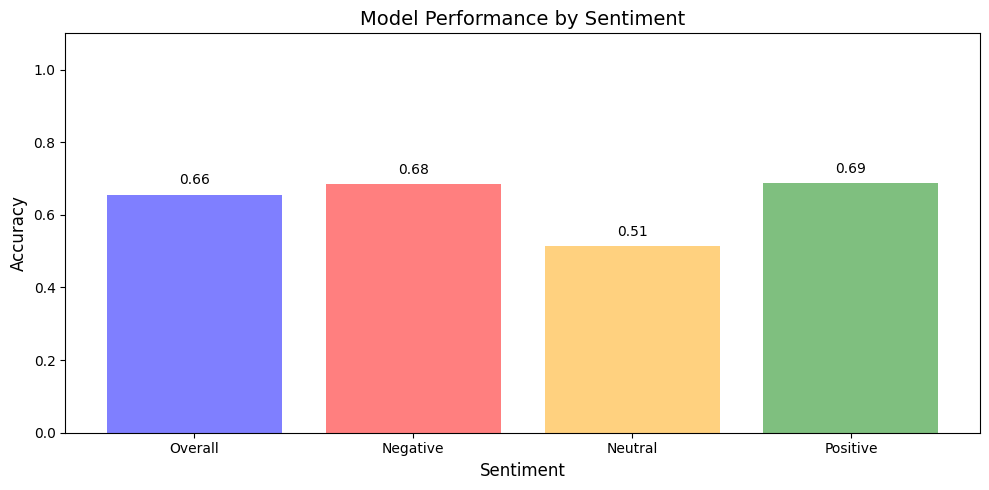

# Indonesian Sentiment Analysis

|                 | Description                                                                                                                             |
|-----------------|-----------------------------------------------------------------------------------------------------------------------------------------|
| **Dataset**     | [SmSA IndoNLU Dataset](https://github.com/IndoNLP/indonlu/tree/ce728f6926a36174b9923dfe49d6a6839b6e9bb7/dataset/smsa_doc-sentiment-prosa) or sentence-level sentiment analysis dataset [(Purwarianti and Crisdayanti, 2019)](https://arxiv.org/pdf/2009.05720) is a collection of comments and reviews in Indonesian obtained from multiple online platforms. The text was crawled and then annotated by several Indonesian linguists to construct this dataset. There are three possible sentiments on the SmSA dataset: positive, negative, and neutral. |
| **Problem**     | Project goal is to perform sentiment analysis on Indonesian text. The problem involves classifying sentences or reviews into one of three sentiment classes: **positive**, **neutral**, or **negative**. This classification is crucial for understanding customer feedback and opinions in various industries. |
| **Machine Learning Solution** | A supervised learning approach is used, where the model is trained on labeled data to predict the sentiment of new, unseen text. The pipeline includes preprocessing the text, transforming it into numerical representations, and training a classification model. TensorFlow Extended (TFX) is employed to ensure a robust and scalable pipeline for sentiment analysis. |
| **Data Processing Methods** | The preprocessing involves the following steps: converting text to lowercase, removing non-alphanumeric characters, filtering out Indonesian stop words, and tokenizing the text for further processing. These transformations are applied consistently during training and inference using TFX. |
| **Model Architecture** | **The Model Layers** <br> - **Input**: Accepts raw text input. <br> - **Reshape**: Converts input shape for processing. <br> - **Text Vectorization**: Transforms text into tokenized sequences. <br> - **Embedding**: Represents text as dense semantic vectors. <br> - **Spatial Dropout**: Regularizes embedding weights. <br> - **Global Average Pooling**: Reduces dimensionality of embeddings. <br> - **Dense**: Applies ReLU activation for non-linear feature transformation. <br> - **Dropout**: Prevents overfitting by randomly zeroing some weights. <br> - **Output**: Produces sentiment predictions with softmax activation. <br> <br> **Best Hyperparameters from Tuning** <br> - **Embedding Dimension**: `96` <br> - **Spatial Dropout Rate**: `0.5` <br> - **Dense Layer Units**: `96` <br> - **Dropout Rate**: `0.3` <br> - **Learning Rate**: `0.001` <br> <br> **Tuning Strategy**: Hyperband with bracket and round optimization. |
| **Evaluation Metrics** | The model is evaluated using accuracy and class-wise performance metrics to assess how well it predicts sentiments. Additionally, slice-based performance analysis are used to gain insights into potential weaknesses of the model, such as misclassification between neutral and other classes. |
| **Model Performance** | **Best Validation Accuracy from Tuning**: `0.8539` <br> **Trial Completion**: 30 trials <br> **Elapsed Time for Tuning**: 8 minutes 34 seconds. <br><br> **Testing Overall Accuracy**: 66% <br> **Class-Wise Accuracy**: <br> - **Negative**: 68% <br>   - **Neutral**: 51% <br>   - **Positive**: 69% <br><br> The model shows good performance in distinguishing negative and positive sentiments but has room for improvement in identifying neutral sentiments. |



## **Reference**

IndoNLU. (2022). https://github.com/IndoNLP/indonlu 

Purwarianti, A and Crisdayanti, I. A. P. A.
(2019). Improving bi-lstm performance for indonesian sentiment analysis using paragraph vector. In 2019 International Conference of Advanced
Informatics: Concepts, Theory and Applications
(ICAICTA), pages 1–5. IEEE. 
https://arxiv.org/pdf/2009.05720

## **Setting Up the Environment**

Follow these steps to set up the environment for the repository:

1. **Clone the repository**  
   Open a bash terminal and execute the following command to clone the repository:  
   ```bash
   git clone https://github.com/kevinadityaikhsan/indonesian-sentiment-analysis
   ```

2. **Navigate to the repository**  
   Change the current directory to the cloned repository:  
   ```bash
   cd indonesian-sentiment-analysis
   ```

3. **Create a new Conda environment**  
   Create a Conda environment with Python 3.9.15:  
   ```bash
   conda create --name mlops-tfx python=3.9.15
   ```  
   When prompted, press `y` to confirm.

4. **Initialize Conda**  
   Run the following command to initialize Conda:  
   ```bash
   conda init
   ```

5. **Restart the terminal**  
   Close the current bash terminal and open a new one.

6. **Activate the Conda environment**  
   Activate the environment created earlier:  
   ```bash
   conda activate mlops-tfx
   ```

7. **Install dependencies**  
   Use the `requirements.txt` file to install all necessary dependencies:  
   ```bash
   pip install -r requirements.txt
   ```

8. **Open the Jupyter Notebook**  
   Open the `notebook.ipynb` from the repository. Select the kernel named `mlops-tfx (Python 3.9.15)` from the kernel menu.

9. **Ready for use**  
   The setup process is complete, and the notebook is ready.
   